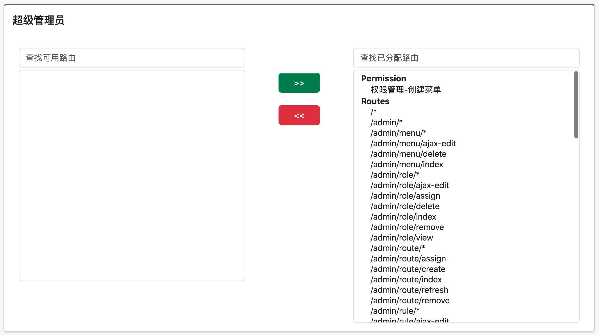
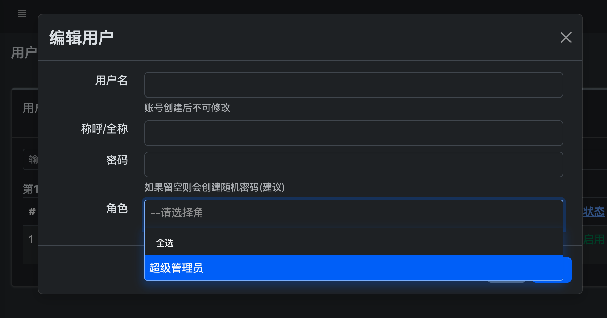

DB-based RBAC Manager for Yii 2 Based on mdm/yii2-rbac
======================
GUI manager for RBAC (Role Base Access Control) Yii2. Easy to manage authorization of user :smile:.

[](https://packagist.org/packages/davidxu/yii2-admin)
[](https://packagist.org/packages/davidxu/yii2-admin)


Documentation
-------------

- [Authorization Guide](http://www.yiiframework.com/doc-2.0/guide-security-authorization.html). Important, read this first before you continue.

Attention
---------
Before you install and use this extension, then make sure that your application has been using the login authentication to the database. especially for yii basic template. Because without it, this extension will produce error and useless.

Installation
------------

### Install With Composer

The preferred way to install this extension is through [composer](http://getcomposer.org/download/).

Either run

```
php composer.phar require davidxu/yii2-admin "~5.0"
```

Or, you may add

```
"davidxu/yii2-admin": "~5.0"
```

to the requirement section of your `composer.json` file and execute `php composer.phar update`.

Configuration
-------------

Once the extension is installed, simply use it in your code by:

in config
```php
'as access' => [
     'class' => '\davidxu\admin\components\AccessControl',
     'allowActions' => [
        // add wildcard allowed action here!
        'site/*',
        'debug/*',
        'admin/*', // only in dev mode
    ],
],
...,
'modules' => [
	'admin' => [
		'class' => '\davidxu\admin\Module',
	],
	...
],
'components' => [
	'authManager' => [
		'class' => 'yii\rbac\DbManager', // only support DbManager
	],
],
```

Because this extension uses 'yii\rbac\DbManager' as authManager, so You should migrate rbac sql first:

```yii migrate --migrationPath=@yii/rbac/migrations```

If You use Yii 2.0.6 version or newer, so then migrate custom table for this extension

```yii migrate --migrationPath=@davidxu/admin/migrations```


Usage
-----

This RBAC manager has four main pages, they are:

### Route
To get all action routes from application. In here, You can on / off permission so not shown in a menu role, rename alias/type of action route, so easy readable by end user.
You can then access `Route` through the following URL:
```
http://localhost/path/to/index.php?r=admin/route
```
Below screenshot of get all routes or add a route


### Role
To define levels of access of user, what he super admin?, staff?, cashier? etc. In this menu, You can assign permission / action route (actions in application, they are create, update, delete, etc) to role.
You can then access `Role` through the following URL:
```
http://localhost/path/to/index.php?r=admin/role
```
Below screenshot of route assignment to a role


### User
For standard user management, create/update/delete user, and assign role(s) to user.
You can then access `User` through the following URL:
```
http://localhost/path/to/index.php?r=admin/user
```
Below screenshot of user management


### Menu
For backend management purpose, we can use sidebar menu.
You can then access `Menu` through the following URL:
```
http://localhost/path/to/index.php?r=admin/menu
```
Below screenshot of menu management


We recommend you to activate pretty URL.

Implementation on Widgets
-------------------------

### Example dynamic menu
It is used for filtering the right access menu
```php
use davidxu\admin\components\MenuHelper;
use davidxu\adminlte4\widgets\Menu;
use Yii;
?>
<nav class="mt-2"> <!--begin::Sidebar Menu-->
    <?php try {
        $callback = function($menu) {
            $data = $menu['data'] ? eval($menu['data']) : '';
            Yii::info($data);
            if (!empty($data)) {
                $iconPrefix = count(explode(' ', $data)) > 1 ? '' : 'bi bi-';
            } else {
                $iconPrefix = '';
            }
            if (!empty($menu['data'])) {
                $iconPrefix = count(explode(' ', $menu['data'])) > 1 ? '' : 'bi bi-';
            } else {
                $iconPrefix = '';
            }
            return [
                'label' => $menu['name'],
                'url' => $menu['route'],
                'icon' => $menu['data'] ? $iconPrefix . $menu['data'] : 'bi bi-circle',
                'items' => $menu['children'],
            ];
        };
        $menuItems = MenuHelper::getAssignedMenu(Yii::$app->user->id);
        echo Menu::widget([
            'items' => $menuItems,
        ]);
    } catch (Exception|Throwable $e) {
        if (YII_ENV_DEV) {
            echo 'Exception: ' . $e->getMessage() . ' (' . $e->getFile() . ':' . $e->getLine() . ")\n";
            echo $e->getTraceAsString() . "\n";
        }
    } ?>
    <!--end::Sidebar Menu-->
</nav>
```

## How to Contribute

This tools is an OpenSource project so your contribution is very welcome.

In order to get started:

- Install this in your local (read installation section)
- Clone this repository.
- Check [README.md](README.md).
- Send [pull requests](https://github.com/davidxu/yii2-admin/pulls).

Aside from contributing via pull requests you may [submit issues](https://github.com/davidxu/yii2-admin/issues).